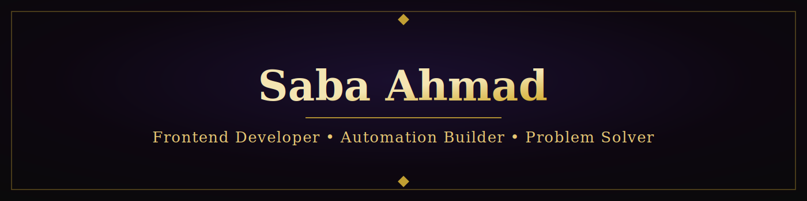

  

  

  
  
  

<h3 align="center">🚀 About Me</h3>

<table align="center">
<tr>
<td width="50%" valign="top">

**🔭 Currently Building**
FractProp.com — a blockchain-powered fractional real estate platform, built with Next.js and full mobile responsiveness.

**🤖 Automation Focus**
Designing AI-driven n8n agents that handle real business tasks — lead qualification, invoice extraction, and research outreach.

</td>
<td width="50%" valign="top">

**🌱 Currently Sharpening**
Advanced Next.js (App Router), AI agent workflows, and scalable component architecture.

**⚡ How I Work**
I care about clean UI, reusable components, and turning repetitive manual work into systems that run on their own.

</td>
</tr>
</table>

<h3 align="center">🛠️ Featured Projects</h3>

<table align="center">
<tr>
<th>Project</th>
<th>Stack</th>
<th>Description</th>
</tr>
<tr>
<td><b>FractProp.com</b></td>
<td>Next.js, React, CSS</td>
<td>Blockchain-powered fractional real estate platform with shared components and full mobile responsiveness</td>
</tr>
<tr>
<td><b>Invoice Extractor Agent</b></td>
<td>n8n, Gmail API, Gemini Vision, Sheets</td>
<td>Automatically extracts invoice data from Gmail and logs it into Google Sheets</td>
</tr>
<tr>
<td><b>Zara — WhatsApp AI Agent</b></td>
<td>n8n, Meta WhatsApp API</td>
<td>AI-powered lead qualification agent for real-time client conversations</td>
</tr>
<tr>
<td><b>Lead Research Agent</b></td>
<td>n8n, AI, Web Scraping</td>
<td>Automated lead research and personalized outreach generator</td>
</tr>
<tr>
<td><b>SabaSH Tools</b></td>
<td>Next.js, React</td>
<td>Multi-tool web app — QR Generator, URL Shortener, Text-to-Speech, AI Writer, Grammar Checker</td>
</tr>
<tr>
<td><b>Bunyad Estates</b></td>
<td>HTML, CSS, SVG</td>
<td>Black & white real estate landing page with custom blueprint-style illustrations</td>
</tr>
</table>

<h3 align="center">💻 Tech Stack</h3>

  

  
  
  
  

<h3 align="center">🤝 Let's Connect</h3>

Open to interesting collaborations, freelance builds, and automation-heavy projects. 
Reach out — always happy to talk shop about clean code and smart systems.

  

<i>Thanks for stopping by ✨</i>

